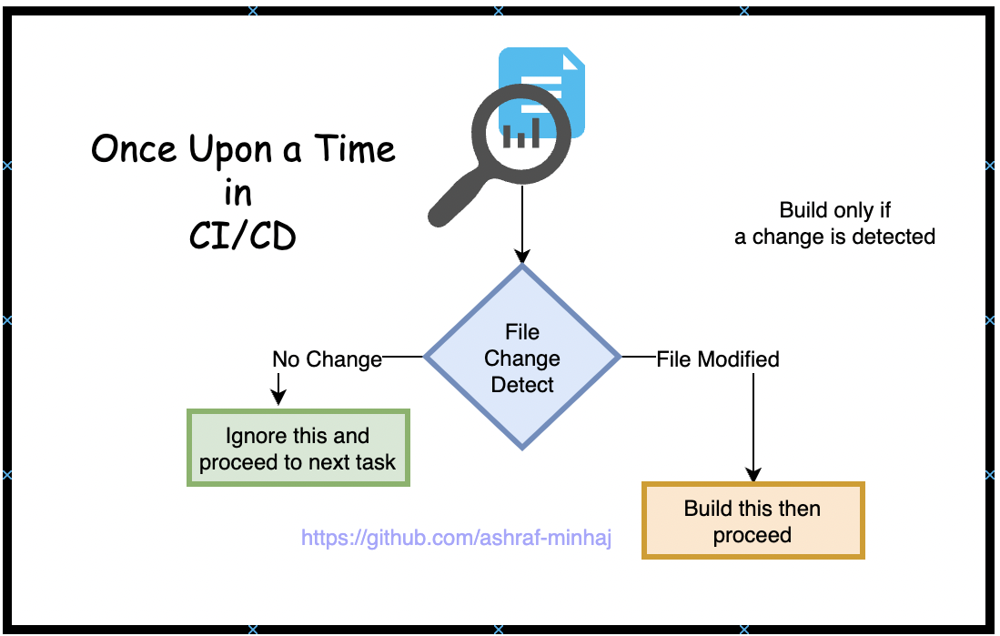

# File Content Change Detector
[](https://www.gnu.org/licenses/gpl-3.0) 

Contents:
[Why?](#why-)
[How it works](#how-it-works)
[Installation](#install-md5sum)
[How to run](#how-to-run)

### Why?
 First, understand the need of this automation
 
 In the process of CI/CD, we don't always need to build all the files. The blind pipelines just process/build everything and eats up time, cicd runtime etc. So I 

### How it works
 TLDR:
 * make hash of a file and store it as a file.
 * make hash of the updated file, compare with the old one.
 * and do whatever you wish to do.
 
 This is where I am making an atttempt to make hash of a file, then store that into another file. While in the process of building, a new hash is created and compared, if any change is detected the file is taken to build and the hash file is updated, else it moves on.

 And the process continues.

### Install md5sum  
 * macOS ->
        ```
        brew install md5sha1sum
        ```

 * Linux ->
        ```
        sudo apt install -y ucommon-utils
        ```

 * Check if installation complete (should return a path) -
        ```
        which md5sum 
        ```

### How to run
 * put your file in the `src` directory. Example file `app.py`.
   Change the name according to your need, don't forget to change in the shell script `file` variable.
        ```
        file="../src/app.py" # change the file name according to your need
        ```
 * go to the `scripts` directory and run -
        ```
        change_detector.sh
        ```

references: [superuser](https://superuser.com/questions/266565/how-to-install-md5-to-ubuntu), [devconnected](https://devconnected.com/how-to-check-if-file-or-directory-exists-in-bash/#:~:text=In%20order%20to%20check%20if%20a%20file%20does%20not%20exist,that%20you%20want%20to%20check.&text=Similarly%2C%20you%20can%20use%20shorter,exist%20directly%20in%20your%20terminal.), [javatpoint](https://www.javatpoint.com/bash-read-file).

(C) Ashraf Minhaj

#### Contact me:
<a href="https://www.linkedin.com/in/ashraf-minhaj/"></a> &nbsp; <a href="mailto: ashraf_minhaj@yahoo.com"></a> &nbsp;